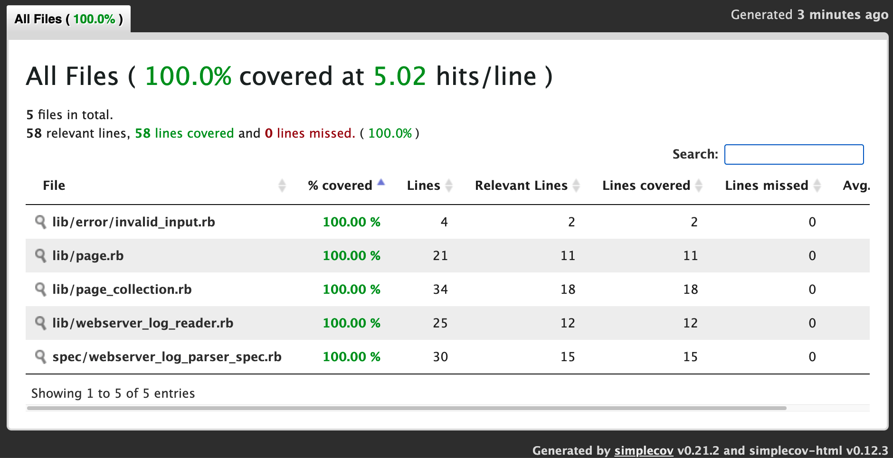

# sp_test_ruby

Practice

## How to run

```
$ ./parser.rb webserver.log
  -- or --
$ ruby parser.rb webserver.log
```

## Example output

`$ ./parser.rb webserver.log`

```
> list of webpages with most page views ordered from most pages views to less page views
  /about/2             90   visits
  /contact             89   visits
  /index               82   visits
  /about               81   visits
  /help_page/1         80   visits
  /home                78   visits

> list of webpages with most unique page views also ordered
  /index               23   unique views
  /home                23   unique views
  /contact             23   unique views
  /help_page/1         23   unique views
  /about/2             22   unique views
  /about               21   unique views
```

## Explanations

- I've chose `File.each_line` to reduce memory usage
- Core Data Structure to store "pages" is Array. It's not efficient, and can be replaced with HashMap in the future. HashMap makes insertion faster, but require conversion to Array when sorting. This change should be easy.
- Why sort_by() + reverse() - [performance is acceptable](https://stackoverflow.com/a/2651028), can be changed just to sort_by with a block
- `printf "%-20s %-4s visits\n"` is not robust solution, but don't want to spend to match time on it

## TODOs

- Check performance with bigger files, compare to HashMap data structure
- Security: prevent reading files from other directories
- GitHub Action for RSpec and Rubocpo
- Wrap every class with module (e.g. `WebserverLogReader::`)

## Coverage snapshot



- parser.rb
- lib/formatter/cli_by_unique_views.rb
- lib/formatter/cli_by_views.rb

Those files are not covered, because they are related to presentation, not the logic. But mainly - lack of time.


### Development

Install, run tests, run linter, run script itself

```
$ bundle
$ bundle exec rspec
$ bundle exec rubocop -a
$ ruby parser.rb webserver.log
```
